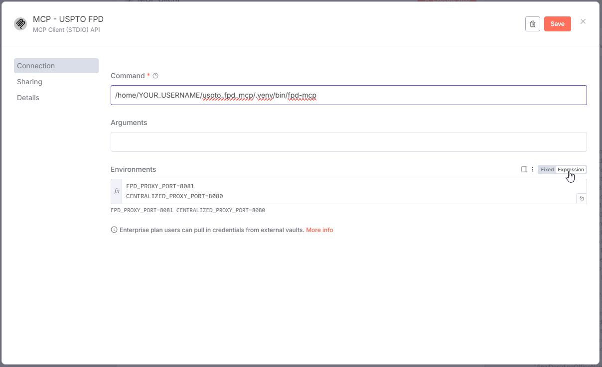
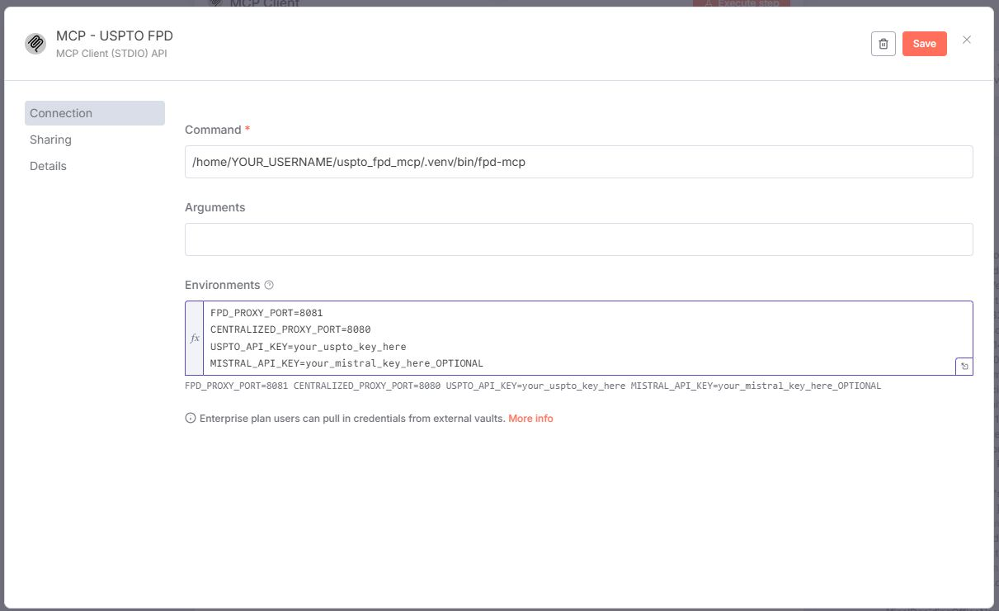
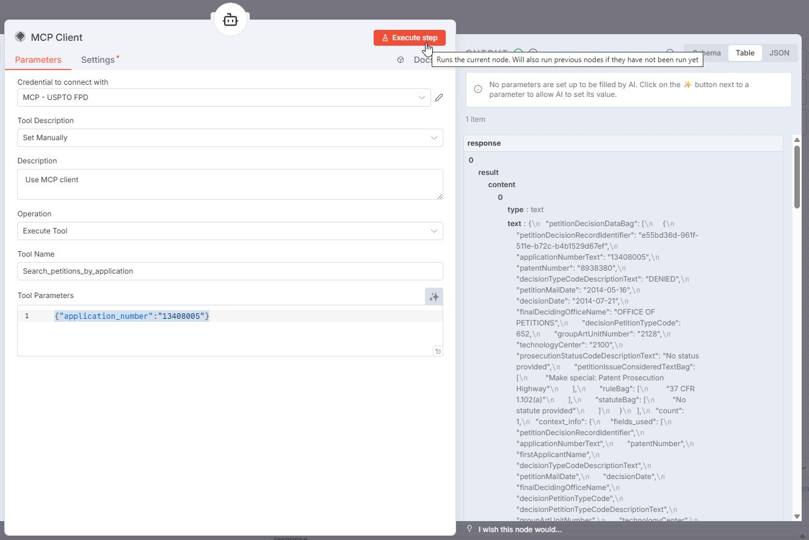

# Installation Guide - Final Petition Decisions MCP

Complete cross-platform installation guide using modern package managers and automated setup scripts.

## 🚀 Quick Start (Recommended)

### Windows Install

**Run PowerShell as Administrator**, then:

```powershell
# Navigate to your user profile
cd $env:USERPROFILE

# If git is installed:
git clone https://github.com/john-walkoe/uspto_fpd_mcp.git
cd uspto_fpd_mcp

# If git is NOT installed:
# Download and extract the repository to C:\Users\YOUR_USERNAME\uspto_fpd_mcp
# Then navigate to the folder:
# cd C:\Users\YOUR_USERNAME\uspto_fpd_mcp

# The script detects if uv is installed and if it is not it will install uv - https://docs.astral.sh/uv

# Run setup script (sets execution policy for this session only):
Set-ExecutionPolicy -ExecutionPolicy Unrestricted -Scope Process
.\deploy\windows_setup.ps1

## View INSTALL.md for sample script output.
# Close Powershell Window.
# If choose option to "configure Claude Desktop integration" during the script then restart Claude Desktop
```

The PowerShell script will:
- ✅ Check for and auto-install uv (via winget or PowerShell script)
- ✅ Install dependencies and create executable
- ✅ Prompt for USPTO API key (required) and Mistral API key (optional) or Detect if you had installed the developer's other USPTO MCPs and ask if want to use existing keys from those installation.
- 🔒 **If entering in API keys, the script will automatically store API keys securely using Windows DPAPI encryption**
- ✅ Ask if you have [USPTO PFW MCP](https://github.com/john-walkoe/uspto_pfw_mcp) already installed, and if so will used the USPTO PFW MCP's default centralized proxy
- ✅ Ask if you want Claude Desktop integration configured
- 🔒 **Offer secure configuration method (recommended) or traditional method (API keys in plain text in the MCP JSON file)**
- ✅ Backups and then automatically merge with existing Claude Desktop config (preserves other MCP servers)
- ✅ Provide installation summary and next steps

**Example Output:**
```
PS C:\Users\YOUR_USERNAME\uspto_fpd_mcp> .\deploy\windows_setup.ps1
=== USPTO Final Petition Decisions MCP - Windows Setup ===

[OK] Loaded API key validation helpers
[INFO] Python NOT required - uv will manage Python automatically

[INFO] uv not found. Installing uv...
Found uv [astral-sh.uv] Version 0.9.13
This application is licensed to you by its owner.
Microsoft is not responsible for, nor does it grant any licenses to, third-party packages.
This package requires the following dependencies:
  - Packages
      Microsoft.VCRedist.2015+.x64
Downloading https://github.com/astral-sh/uv/releases/download/0.9.13/uv-x86_64-pc-windows-msvc.zip
  ██████████████████████████████  20.0 MB / 20.0 MB
Successfully verified installer hash
Extracting archive...
Successfully extracted archive
Starting package install...
Command line alias added: "uvx"
Command line alias added: "uv"
Command line alias added: "uvw"
Path environment variable modified; restart your shell to use the new value.
Successfully installed
[OK] uv installed via winget
[OK] uv is now accessible: uv 0.9.13 (7ca92dcf6 2025-11-26)
[INFO] Installing dependencies with uv...
[INFO] Installing dependencies with prebuilt wheels (Python 3.12)...
Using CPython 3.12.11
Creating virtual environment at: .venv
Resolved 50 packages in 2ms
Installed 49 packages in 1.10s
 + annotated-doc==0.0.4
 + annotated-types==0.7.0
...
 + watchfiles==1.1.1
 + websockets==15.0.1
[OK] Dependencies installed
[OK] pyvenv.cfg already exists (newer uv version)
[INFO] Verifying installation...
[WARN] Warning: Command verification failed - check PATH
[INFO] You can run the server with: uv run fpd-mcp

==========================================
SECURE API KEY CONFIGURATION
==========================================

API keys will be stored in DPAPI encrypted storage
Location: ~/.uspto_api_key and ~/.mistral_api_key
Encryption: Windows Data Protection API (user + machine specific)

[INFO] Checking for existing API keys in secure storage...
[INFO] Testing secure storage system...
[OK] Secure storage system working
[INFO] No API keys found in encrypted storage

API Key Format Requirements:
============================

USPTO API Key:
  - Required: YES
  - Length: Exactly 30 characters
  - Format: Lowercase letters only (a-z)
  - Example: abcdefghijklmnopqrstuvwxyzabcd
  - Get from: https://data.uspto.gov/myodp/

Mistral API Key:
  - Required: NO (optional, for OCR)
  - Length: Exactly 32 characters
  - Format: Letters (a-z, A-Z) and numbers (0-9)
  - Example: AbCdEfGh1234567890IjKlMnOp1234
  - Get from: https://console.mistral.ai/


Enter your USPTO API key (required - get from https://data.uspto.gov/myodp/):

Enter your USPTO API key: ****************************** [your_uspto_key_here]
[OK] USPTO API key format validated (30 chars, lowercase)

[INFO] Mistral API key is OPTIONAL (for OCR on scanned petition documents)
       Without it, you can still use free PyPDF2 extraction for text-based PDFs

[INFO] Mistral API key is OPTIONAL (for OCR on scanned documents)
[INFO] Press Enter to skip, or enter your 32-character Mistral API key

Enter your Mistral API key (or press Enter to skip): ******************************** [your_mistral_key_here_OPTIONAL]
[OK] Mistral API key format validated (32 chars, alphanumeric)

[INFO] Storing API keys in DPAPI encrypted storage...

[OK] USPTO API key stored in DPAPI encrypted storage
     Location: ~/.uspto_api_key (DPAPI encrypted)
     File marked as hidden
[OK] USPTO API key stored in encrypted storage
[OK] Mistral API key stored in DPAPI encrypted storage
     Location: ~/.mistral_api_key (DPAPI encrypted)
     File marked as hidden
[OK] Mistral API key stored in encrypted storage

[OK] Encrypted storage benefits:
     - Single-key-per-file architecture
     - DPAPI encryption (user + machine specific)
     - Shared across all USPTO MCPs (FPD/PFW/PTAB/Citations)
     - Files: ~/.uspto_api_key, ~/.mistral_api_key
     - Hidden file attributes applied

USPTO MCP Ecosystem Integration

The USPTO Patent File Wrapper (PFW) MCP provides a centralized proxy server
that offers enhanced features when used with FPD MCP:
  - Persistent document links (7-day encrypted URLs)
  - Unified rate limiting across all USPTO MCPs
  - Cross-MCP document sharing and caching

Do you have the USPTO PFW MCP already installed? (y/N): n
[INFO] FPD will run in standalone mode with local proxy (always-on)
       Install USPTO PFW MCP later for enhanced features:
       https://github.com/johnwalkoe/patent_filewrapper_mcp

[INFO] Configuring shared INTERNAL_AUTH_SECRET...
[OK] Using existing INTERNAL_AUTH_SECRET from unified storage
     Location: ~/.uspto_internal_auth_secret (DPAPI encrypted)
     Shared with other installed USPTO MCPs
     This secret authenticates internal MCP communication

Claude Desktop Configuration

Would you like to configure Claude Desktop integration? (Y/n): y

Claude Desktop Configuration Method:
  [1] Secure Python DPAPI (recommended) - API keys loaded from encrypted storage
  [2] Traditional - API keys stored in Claude Desktop config file

Enter choice (1 or 2, default is 1): 1
[OK] Using DPAPI encrypted storage (secure)
     API keys will be loaded automatically from encrypted storage
     No API keys will be stored in Claude Desktop config file

[INFO] Claude Desktop config location: C:\Users\YOUR_USERNAME\AppData\Roaming\Claude\claude_desktop_config.json
[INFO] Existing Claude Desktop config found
[INFO] Merging USPTO FPD configuration with existing config...
[INFO] Backup created: C:\Users\YOUR_USERNAME\AppData\Roaming\Claude\claude_desktop_config.json.backup_20251129_221343
[OK] Successfully merged USPTO FPD configuration!
[OK] Your existing MCP servers have been preserved
[INFO] API keys are NOT in config file (loaded from encrypted storage)
[INFO] Configuration backup saved at: C:\Users\YOUR_USERNAME\AppData\Roaming\Claude\claude_desktop_config.json.backup_20251129_221343
[OK] Claude Desktop configuration complete!

==========================================
Windows setup complete!
==========================================

Please restart Claude Desktop to load the MCP server

Configuration Summary:

  [OK] USPTO API Key: Stored in DPAPI encrypted storage
       Location: ~/.uspto_api_key (DPAPI encrypted + hidden)
  [OK] Mistral API Key: Stored in DPAPI encrypted storage
       Location: ~/.mistral_api_key (DPAPI encrypted + hidden)

  [OK] Storage Architecture: Single-key-per-file (shared across USPTO MCPs)
  [OK] Proxy Port: 8081
  [OK] Installation Directory: C:/Users/John.WALKOE/uspto_fpd_mcp

Security Features:
  [*] Configuration Method: DPAPI Encrypted Storage (Secure)
  [*] API keys encrypted with Windows DPAPI (user and machine specific)
  [*] API keys NOT in Claude Desktop config file
  [*] API keys NOT visible in process list (environment variables used)
  [*] API key format validation (prevents typos)
  [*] Hidden file attributes applied to key files
  [*] Audit logging enabled (~/.uspto_mcp_audit.log)

Available Tools (7):
  - fpd_search_petitions_minimal (ultra-fast discovery)
  - fpd_search_petitions_balanced (detailed analysis)
  - fpd_search_by_art_unit (art unit quality)
  - fpd_search_by_application (petition history)
  - fpd_get_petition_details (full details)
  - fpd_get_document_download (PDF downloads)
  - fpd_get_tool_reflections (workflow guidance)

Proxy Server:
  Start with: uv run fpd-proxy
  Port: 8081 (avoids conflict with PFW on 8080)

Key Management:
  Manage keys: ./deploy/manage_api_keys.ps1
  Cross-MCP:   Keys shared with PFW, PTAB, and Citations MCPs

Test with: fpd_search_petitions_minimal
Learn workflows: fpd_get_tool_reflections

```

## 🔒 Windows Secure Configuration Options

During the Windows setup, you'll be presented with two configuration methods:

### Method 1: Secure Python DPAPI (Recommended)

- 🔒 **API keys encrypted with Windows DPAPI**
- 🔒 **API keys not stored in Claude Desktop config file**
- ⚡ **Direct Python execution with built-in secure storage**
- ✅ **No PowerShell execution policy requirements**

**Example Configuration Generated:**

```json
{
  "mcpServers": {
    "uspto_fpd": {
      "command": "C:/Users/YOUR_USERNAME/uspto_fpd_mcp/.venv/Scripts/python.exe",
      "args": ["-m", "fpd_mcp.main"],
      "cwd": "C:/Users/YOUR_USERNAME/uspto_fpd_mcp",
      "env": {
        "CENTRALIZED_PROXY_PORT": "none",
        "FPD_PROXY_PORT": "8081",
        "INTERNAL_AUTH_SECRET": "your_selfgenerated_uspto_Cross_MCP_Shared_Secret"
      }
    }
  }
}
```

### Method 2: Traditional

- 📄 **API keys stored in Claude Desktop config file**
- 🔓 **Less secure - keys visible in config**
- ⚡ **Direct Python execution**
- ✅ **Simpler setup**

**Example Configuration Generated:**

```json
{
  "mcpServers": {
    "uspto_fpd": {
      "command": "C:/Users/YOUR_USERNAME/uspto_fpd_mcp/.venv/Scripts/python.exe",
      "args": ["-m", "fpd_mcp.main"],
      "cwd": "C:/Users/YOUR_USERNAME/uspto_fpd_mcp",
      "env": {
        "USPTO_API_KEY": "your_actual_api_key_here",
        "MISTRAL_API_KEY": "your_mistral_key_here",
        "CENTRALIZED_PROXY_PORT": "none",
        "FPD_PROXY_PORT": "8081"
      }
    }
  }
}
```

### Windows DPAPI Secure Storage API Key Management

If you want to manage your Secure Storage API keys manually:

```
# Navigate to your user profile
cd $env:USERPROFILE

# Navigate to the Project Folder
cd uspto_fpd_mcp

.\deploy\manage_api_keys.ps1

OUTPUT

USPTO MCP API Key Management
============================
MCP Type: FPD (Final Petition Decisions)

Current API Keys:
  USPTO API Key:   **************************seto
  Mistral API Key: ****************************D4c2

Actions:
  [1] Update USPTO API key
  [2] Update Mistral API key
  [3] Remove API key(s)
  [4] Test API key functionality
  [5] View INTERNAL_AUTH_SECRET (for manual config)
  [6] Show key requirements
  [7] Exit

Enter choice (1-7):

```

##

## :penguin: Quick Start Linux (Claude Code)

**Open terminal**, then:

```bash
# Navigate to your home directory
cd ~
# Clone the repository (if git is installed):
git clone https://github.com/john-walkoe/uspto_fpd_mcp.git
cd uspto_fpd_mcp

# If git is NOT installed:
# Download and extract the repository to ~/uspto_fpd_mcp
# Then navigate to the folder:
# cd ~/uspto_pfw_mcp

# Make script executable and run
chmod +x deploy/linux_setup.sh
./deploy/linux_setup.sh

# Restart Claude Code if you configured integration
```

**Note**: Claude Desktop is not available on Linux. The script configures Claude Code integration instead.

The Linux script will:

- ✅ Auto-install uv package manager if not present
- ✅ Install dependencies and create executable
- ✅ Prompt for USPTO API key (required) with validation
- ✅ Prompt for Mistral API key (optional for OCR)
- ✅ API keys stored in separate secure storage files
- ✅ Ask if you have [USPTO PFW MCP](https://github.com/john-walkoe/uspto_pfw_mcp) already installed, and if so will used the USPTO PFW MCP's default centralized proxy
- ✅ **Interactive Claude Desktop configuration** with existing config merging
- ✅ **Automatic config merging** - preserves existing MCP servers with timestamped backups
- ✅ Provide installation summary and testing instructions

**Example Output:**
```
USER@debian:~/uspto_fpd_mcp# ./deploy/linux_setup.sh
=== USPTO Final Petition Decisions MCP - Linux Setup ===

[OK] Loaded API key validation helpers
[INFO] UV will handle Python installation automatically

[OK] uv found: uv 0.7.10

[INFO] Installing project dependencies with uv...
Using CPython 3.13.3
Creating virtual environment at: .venv
Resolved 58 packages in 392ms
      Built fpd-mcp @ file:///USER/uspto_fpd_mcp
Prepared 4 packages in 351ms
░░░░░░░░░░░░░░░░░░░░ [0/56] Installing wheels...                                                                                                                                               warning: Failed to hardlink files; falling back to full copy. This may lead to degraded performance.
         If the cache and target directories are on different filesystems, hardlinking may not be supported.
         If this is intentional, set `export UV_LINK_MODE=copy` or use `--link-mode=copy` to suppress this warning.[*]
Installed 56 packages in 9.41s
 + annotated-doc==0.0.4
 + annotated-types==0.7.0
...
 + watchfiles==1.1.1
 + websockets==15.0.1
[OK] Dependencies installed successfully
[INFO] Installing USPTO Final Petition Decisions MCP package...
Resolved 42 packages in 28ms
      Built fpd-mcp @ file:///USER/uspto_fpd_mcp
Prepared 1 package in 181ms
Uninstalled 1 package in 38ms
░░░░░░░░░░░░░░░░░░░░ [0/1] Installing wheels...                                                                                                                                                warning: Failed to hardlink files; falling back to full copy. This may lead to degraded performance.
         If the cache and target directories are on different filesystems, hardlinking may not be supported.
         If this is intentional, set `export UV_LINK_MODE=copy` or use `--link-mode=copy` to suppress this warning.[*]
Installed 1 package in 130ms
 ~ fpd-mcp==1.0.0 (from file:///USER/uspto_fpd_mcp)
[OK] Package installed successfully
[INFO] Verifying installation...
[OK] Package import successful - can run with: uv run fpd-mcp

==========================================
SECURE API KEY CONFIGURATION
==========================================

[INFO] API keys will be stored in ENCRYPTED secure storage
[INFO] Location: ~/.uspto_api_key and ~/.mistral_api_key
[INFO] Format: Secure file storage (Linux: file permissions 600)

Enter your USPTO API key (required - get from https://data.uspto.gov/myodp/):
> [your_actual_USPTO_api_key_here[**]]
✓ USPTO API key format valid (30 lowercase letters)

[OK] USPTO API key format validated

Enter your Mistral API key (optional for OCR - press Enter to skip):
> [your_mistral_api_key_here_OPTIONAL[**]]
✓ Mistral API key format valid (32 alphanumeric characters)

[INFO] Storing API keys in encrypted secure storage...

Disabled features: maintenance_mode, read_only_mode
DPAPI not available - storing with file permissions only
[OK] USPTO API key stored in secure storage
[INFO]     Location: ~/.uspto_api_key
[INFO]     Permissions: 600 (owner read/write only)
[OK]     Verified: File permissions are secure (600)

Disabled features: maintenance_mode, read_only_mode
DPAPI not available - storing with file permissions only
[OK] Mistral API key stored in secure storage
[INFO]     Location: ~/.mistral_api_key
[INFO]     Permissions: 600 (owner read/write only)

[OK] API keys stored securely - NOT in Claude Code config file!
[INFO] Keys will be loaded automatically from encrypted storage at runtime

[INFO] USPTO MCP Ecosystem Integration

The USPTO Patent File Wrapper (PFW) MCP provides a centralized proxy server
that offers enhanced features when used with FPD MCP:
  - Persistent document links (7-day encrypted URLs)
  - Unified rate limiting across all USPTO MCPs
  - Cross-MCP document sharing and caching

Do you have the USPTO PFW MCP already installed? (y/N): y
[OK] FPD will use PFW's centralized proxy for enhanced features
[INFO] No local proxy configuration needed

[INFO] Claude Code Configuration

Would you like to configure Claude Code integration? (Y/n): y
[INFO] Claude Code config location: /USER/.claude.json
[INFO] Existing Claude Code config found
[INFO] Merging USPTO FPD configuration with existing config...
[INFO] Backup created: /USER/.claude.json.backup_20251130_162941
SUCCESS
[OK] Successfully merged USPTO FPD configuration!
[OK] Your existing MCP servers have been preserved
[INFO] ✅ API keys are NOT in config file (loaded from secure storage)
[OK] Secured config file permissions (chmod 600)
[OK] Claude Code configuration complete!

==========================================
[OK] Linux setup complete!
==========================================

[WARN] Please restart Claude Code to load the MCP server

[INFO] Configuration Summary:

[OK] ✓ USPTO API Key: Stored in encrypted secure storage
[INFO]     File: ~/.uspto_api_key (permissions: 600)
[INFO]     Encryption: File permissions + Linux security
[OK] ✓ Mistral API Key: Stored in encrypted secure storage
[INFO]     File: ~/.mistral_api_key (permissions: 600)
[INFO]     OCR: Enabled

[OK] ✓ Installation Directory: /USER/uspto_fpd_mcp

[OK] ✓ Claude Code config: /USER/.claude.json
[INFO]     API keys: NOT in config (loaded from secure storage)
[INFO]     Permissions: 600

[INFO] Security Features:
  ✓ API keys stored in encrypted secure storage (NOT plain text)
  ✓ File permissions: 600 on all sensitive files
  ✓ Directory permissions: 700 on config directories
  ✓ API key format validation (prevents typos)
  ✓ Audit logging enabled (~/.uspto_mcp_audit.log)

[INFO] Test the server:
  uv run fpd-mcp --help

[INFO] Test with Claude Code:
  Ask Claude: 'Use fpd_search_petitions_minimal to search for patents'

[INFO] Manage API keys:
  Run: ./deploy/manage_api_keys.ps1 (Windows) or edit secure storage files
USER@debian:~/uspto_fpd_mcp#
```

*The warnings are just uv being verbose about filesystem optimization.  This is similar to seeing compiler warnings that don't affect the final program - informational but not problematic.

** When typing in the API keys no output is displayed as a security feature.

**Test Claude Code's MCP**

```
USER@debian:~/uspto_pfw_mcp# claude mcp list
Checking MCP server health...

uspto_fpd: uv --directory /USER/uspto_fpd_mcp run fpd-mcp - ✓ Connected
```

**Example Configuration Generated:**

```json
{
  "mcpServers": {
    "uspto_fpd": {
      "type": "stdio",
      "command": "uv",
      "args": [
        "--directory",
        "/USER/uspto_fpd_mcp",
        "run",
        "fpd-mcp"
      ],
      "env": {
        "FPD_PROXY_PORT": "8081",
        "CENTRALIZED_PROXY_PORT": "8080"
      }
    }
  }
```

## 🔀 n8n Integration (Linux)

For workflow automation with **locally hosted n8n instances**, you can integrate the USPTO Final Petition Decisions MCP as a node using nerding-io's community MCP client connector.

**Requirements:**

- ✅ **Self-hosted n8n instance** (local or server deployment)
- ✅ **n8n version 1.0.0+** (required for community nodes)
- ✅ **nerding-io's Community MPC Client node**: [n8n-nodes-mcp](https://github.com/nerding-io/n8n-nodes-mcp)
- ❌ **Cannot be used with n8n Cloud** (requires local filesystem access to MCP executables)

**For AI Agent Integration:**

- Must set `N8N_COMMUNITY_PACKAGES_ALLOW_TOOL_USAGE=true` environment variable

### Setup Steps

1. **Install n8n** (if not already installed):

   ```bash
   npm install -g n8n

   # Or using Docker with required environment variable
   docker run -it --rm --name n8n -p 5678:5678 \
     -e N8N_COMMUNITY_PACKAGES_ALLOW_TOOL_USAGE=true \
     n8nio/n8n
   ```

2. **Install nerding-io's Community MPC Client Node:**

   Follow the [n8n community nodes installation guide](https://docs.n8n.io/integrations/community-nodes/installation/):

   ```bash
   # Method 1: Via n8n UI
   # Go to Settings > Community Nodes > Install
   # Enter: n8n-nodes-mcp

   # Method 2: Via npm (for self-hosted)
   npm install n8n-nodes-mcp

   # Method 3: Via Docker environment
   # Add to docker-compose.yml:
   # environment:
   #   - N8N_NODES_INCLUDE=[n8n-nodes-mcp]
   ```

3. **Configure Credentials:**

   n8n MCP Configuration Example #1 (Where the install script (uspto_fpd_mcp/deploy/linux_setup.sh) was used and API keys were stored in secure storage files)

   

   n8n MCP Configuration Example #2 (More traditional where API keys were not stored in secure storage files)

   

   - **Connection Type**: `Command-line Based Transport (STDIO)`

   - **Command**: `/home/YOUR_USERNAME/uspto_fpd_mcp/.venv/bin/fpd-mcp` (see below step 4 on how to get)

   - **Arguments**: (leave empty)

   - **Environment Variables** (***Entered in as Expression***):

     If the uspto_fpd_mcp/deploy/linux_setup.sh was used and API keys are stored in secure storage files use the following

     ```json
     FPD_PROXY_PORT=8081
     CENTRALIZED_PROXY_PORT=8080
     ```

     or for a more traditional approach where you enter in your API keys

     ```json
     FPD_PROXY_PORT=8081
     CENTRALIZED_PROXY_PORT=8080
     USPTO_API_KEY=your_uspto_key_here
     MISTRAL_API_KEY=your_mistral_key_here_OPTIONAL
     ```

4. **Get Command Path:**

   Run in your project directory:

   ```bash
   echo "$(pwd)/.venv/bin/fpd-mcp"
   ```

   Take the directory path and append `fpd-mcp` to get your command:

   ```
   /home/YOUR_USERNAME/uspto_fpd_mcp/.venv/bin/fpd-mcp
   ```

   Use this full path as your command in the n8n MCP configuration.

5. **Add MCP Client Node:**

   - In n8n workflow editor, add "MCP Client (STDIO) API" node
   - Select your configured credentials
   - Choose operation (List Tools, Execute Tool, etc.)

6. **Test Connection:**

   - Use "List Tools" operation to see available USPTO Final Petition Decisions functions
   - Use "Execute Tool" operation with `Search_petitions_by_application`
   - Parameters example: `{"application_number":"13408005"}`
   - Results of the Execute Tool should look like this if everything is working correctly



### Example n8n Workflow Use Cases

- **Automated Red Flag Monitoring:** Schedule searches for revival petitions and examiner disputes
- **Due Diligence Automation:** Regular petition analysis for M&A portfolio assessment
- **Art Unit Quality Tracking:** Automated monitoring of art unit petition patterns
- **Cross-MCP Workflows:** Integrate petition data with prosecution history (PFW) and PTAB challenges
- **Legal Research Automation:** Systematic Director decision analysis for precedent research

The n8n integration enables powerful automation workflows combining USPTO petition data with other business systems and legal research tools.

## 🔧 Configuration

### Environment Variables

**Required:**

- `USPTO_API_KEY`: Your USPTO API key (free from [USPTO Open Data Portal](https://data.uspto.gov/myodp/))

**Optional with defaults:**

- `MISTRAL_API_KEY`: Mistral API key for OCR on scanned petition documents (Default: None - uses free PyPDF2 extraction)
- `FPD_PROXY_PORT`: Local proxy server port (Default: `8081` - avoids conflict with PFW on 8080)
- `ENABLE_PROXY_SERVER`: Enable/disable proxy functionality (Default: `true`)
- `ENABLE_ALWAYS_ON_PROXY`: Start proxy immediately vs on-demand (Default: `true`)
  - `true`: Proxy starts immediately when MCP launches - download links work instantly
  - `false`: Legacy on-demand mode - proxy starts on first download (not recommended)
- `USPTO_TIMEOUT`: API request timeout in seconds (Default: `30.0`)
- `USPTO_DOWNLOAD_TIMEOUT`: Document download/OCR timeout in seconds (Default: `60.0`)

**PFW Integration (Instant Detection):**

- `CENTRALIZED_PROXY_PORT`: Centralized PFW proxy port (Default: `none` - instant startup)
  - `none` (default): Skip HTTP detection for instant startup (~0.1s vs 2s)
  - `<port>`: Use specific port (e.g., `8080`) - validates with quick HTTP probe
  - Auto-detected: Falls back to HTTP probing ports 8080, 8079, 8082, 8083
  - **Performance tip:** Set to `none` explicitly if you don't have PFW installed for instant startup

### Always-On Proxy Mode (New Default)

The proxy server now starts **immediately** when the MCP launches (always-on mode by default):

**Benefits:**

- ✅ **Instant download links** - No delays or initialization needed
- ✅ **Simplified workflow** - No need to call download tool first to start proxy
- ✅ **Better UX** - Download links work immediately in all scenarios
- ✅ **PFW integration** - Automatically uses PFW's centralized proxy when available

**How it works:**

1. **MCP starts** → Checks `CENTRALIZED_PROXY_PORT` environment variable (instant)
2. **PFW detected?** → Uses PFW centralized proxy (no local proxy needed)
3. **PFW not detected?** → Uses local FPD proxy on port 8081 (always-on)
4. **Download requests** → Work immediately with no delays
5. **Startup time:** ~0.1s when `CENTRALIZED_PROXY_PORT=none`, ~2s with HTTP detection fallback

**Legacy Mode:**
Set `ENABLE_ALWAYS_ON_PROXY=false` to revert to on-demand startup (not recommended).

### Persistent Links (Progressive Enhancement)

FPD MCP supports **7-day persistent encrypted links** when USPTO PFW MCP is installed:

**Default Behavior:** `generate_persistent_link=True` (progressive enhancement)

**How it works:**

1. **With PFW installed:**
   - Returns 7-day encrypted persistent link via PFW's centralized database
   - Links work across MCP restarts and can be shared/bookmarked

2. **Without PFW (standalone):**
   - Returns error suggesting retry with `generate_persistent_link=false`
   - LLM automatically retries with immediate session-based link
   - Graceful degradation - works for everyone

**Ecosystem Integration:**

- **FPD provides:** Fast petition analysis, immediate downloads (standalone)
- **PFW provides:** Persistent links, centralized proxy, enhanced features
- **Together:** Complete USPTO prosecution + petition workflow integration


### Claude Code MCP Configuration (Recommended)

**Method 1: Using Claude Code CLI**

```powershell
# Windows Powershell - uv installation (Claude Code)
claude mcp add uspto_fpd -s user `
  -e USPTO_API_KEY=your_actual_api_key_here `
  -e MISTRAL_API_KEY=your_mistral_api_key_here_OPTIONAL `
  -e FPD_PROXY_PORT=8081 `
  -e CENTRALIZED_PROXY_PORT=8080 `
  -- uv --directory C:\Users\YOUR_USERNAME\uspto_fpd_mcp run fpd-mcp

# Linux - uv installation (Claude Code)
claude mcp add uspto_fpd -s user \
  -e USPTO_API_KEY=your_actual_api_key_here \
  -e MISTRAL_API_KEY=your_mistral_api_key_here_OPTIONAL \
  -e FPD_PROXY_PORT=8081 \
  -e CENTRALIZED_PROXY_PORT=8081 \
  -- uv --directory /home/YOUR_USERNAME/uspto_fpd_mcp run fpd-mcp
```

### Claude Desktop Configuration

**For uv installations (recommended to use the deploy scripts so don't have to set this):**

```json
{
  "mcpServers": {
    "uspto_fpd": {
      "command": "uv",
      "args": [
        "--directory",
        "C:/Users/YOUR_USERNAME/uspto_fpd_mcp",
        "run",
        "fpd-mcp"
      ],
      "env": {
        "USPTO_API_KEY": "your_actual_api_key_here",
        "MISTRAL_API_KEY": "your_mistral_api_key_here_OPTIONAL",
        "FPD_PROXY_PORT": "8081",
        "CENTRALIZED_PROXY_PORT": "8080"
      }
    }
  }
}
```

**For traditional pip installations:**

```json
{
  "mcpServers": {
    "uspto_fpd": {
      "command": "python",
      "args": [
        "-m",
        "fpd-mcp"
      ],
      "cwd": "C:/Users/YOUR_USERNAME/uspto_fpd_mcp",
      "env": {
        "USPTO_API_KEY": "your_actual_api_key_here",
        "MISTRAL_API_KEY": "your_mistral_api_key_here_OPTIONAL",
        "FPD_PROXY_PORT": "8081",
        "CENTRALIZED_PROXY_PORT": "8080"
      }
    }
  }
}
```

## 📋 Manual Installation (Advanced)

### Prerequisites

- **uv package manager** - [Install Guide](https://docs.astral.sh/uv/getting-started/installation/)
- **USPTO API Key** - [Get Key](https://data.uspto.gov/myodp/)
- **Mistral API Key** (optional) - For OCR functionality from [Mistral AI](https://mistral.ai/solutions/document-ai)
- **Claude Desktop or Claude Code** - For MCP integration

**Note:** The Mistral API key is optional. Without it, document extraction uses free PyPDF2 (works for text-based PDFs). With it, OCR is available for scanned documents (~$0.001/page).

### Step 1: Install uv (if not already installed)

**Windows:**

```powershell
# Direct installation (no admin rights needed)
powershell -c "irm https://astral.sh/uv/install.ps1 | iex"

# Or using winget
winget install --id=astral-sh.uv -e

# Close and reopen powershell for path to take effect
```

**Linux:**

```bash
# Direct installation
curl -LsSf https://astral.sh/uv/install.sh | sh

# Add to PATH (add to ~/.bashrc for persistence)
export PATH="$HOME/.local/bin:$PATH"
```

### Step 2: Clone & Install

```bash
# Navigate to your user profile
#Windows
cd $env:USERPROFILE

#Linux
cd ~

# Clone repository
git clone https://github.com/john-walkoe/uspto_fpd_mcp.git
cd uspto_fpd_mcp

# Create virtual environment
uv venv

# Install dependencies (uv handles Python automatically)
uv sync

# Install in development mode
uv pip install -e .

# Verify installation
uv run fpd-mcp --help
```

### Step 3: Configure Environment

Set your USPTO API key as an environment variable:

**Windows (PowerShell):**
```powershell
$env:USPTO_API_KEY="your_uspto_key_here"
$env:MISTRAL_API_KEY="your_mistral_key_here_OPTIONAL"

# Optional: Configure proxy and API timeouts (defaults shown)
$env:FPD_PROXY_PORT="8081"             # Proxy server port (default: 8081)
$env:ENABLE_PROXY_SERVER="true"        # Enable/disable proxy (default: true)
$env:USPTO_TIMEOUT="30.0"              # API request timeout in seconds
$env:USPTO_DOWNLOAD_TIMEOUT="60.0"     # Document download/OCR timeout in seconds
```

**Linux/Mac:**
```bash
export USPTO_API_KEY="your_uspto_key_here"
export MISTRAL_API_KEY="your_mistral_key_here_OPTIONAL"

# Optional: Configure proxy and API timeouts (defaults shown)
export FPD_PROXY_PORT="8081"             # Proxy server port (default: 8081)
export ENABLE_PROXY_SERVER="true"        # Enable/disable proxy (default: true)
export USPTO_TIMEOUT="30.0"              # API request timeout in seconds
export USPTO_DOWNLOAD_TIMEOUT="60.0"     # Document download/OCR timeout in seconds
```

### Environment Variables Reference

| Variable | Required | Default | Description |
|----------|----------|---------|-------------|
| `USPTO_API_KEY` | ✅ Yes | None | USPTO API key (free from [USPTO Open Data Portal](https://data.uspto.gov/myodp/)) |
| `MISTRAL_API_KEY` | ❌ No | None | Mistral API key for OCR on scanned PDFs (from [Mistral AI](https://console.mistral.ai/api-keys/)) |
| `FPD_PROXY_PORT` | ❌ No | `8081` | Proxy server port (default avoids PFW on 8080) |
| `ENABLE_PROXY_SERVER` | ❌ No | `true` | Enable/disable proxy server (`true`/`false`) |
| `USPTO_TIMEOUT` | ❌ No | `30.0` | API request timeout in seconds |
| `USPTO_DOWNLOAD_TIMEOUT` | ❌ No | `60.0` | Document download/OCR timeout in seconds |

### Step 4: Test Installation

```bash
# Run basic tests
uv run python tests/test_basic.py

# Expected output:
============================================================
Final Petition Decisions MCP - Basic Tests
============================================================
Testing imports...
Disabled features: maintenance_mode, read_only_mode
[OK] Settings imported successfully
[OK] FieldManager imported successfully
cachetools not available - caching disabled
[OK] FPDClient imported successfully

Testing FieldManager...
[OK] FieldManager loaded config from: uspto_fpd_mcp\field_configs.yaml
[OK] Retrieved 8 minimal fields
[OK] Retrieved 18 balanced fields
[OK] Retrieved context settings: {'max_minimal_results': 100, 'max_balanced_results': 20, 'max_document_results': 50}

Testing Settings...
[OK] Settings loaded successfully
[OK] API Base URL: https://api.uspto.gov/api/v1/petition/decisions
[OK] Default minimal limit: 50
[OK] Max search limit: 200
[OK] Field config exists at: uspto_fpd_mcp\field_configs.yaml

Testing FPDClient initialization...
[OK] FPDClient initialized successfully
[OK] Base URL: https://api.uspto.gov/api/v1/petition/decisions
[OK] Max search limit: 1000
[OK] Retry attempts: 3

============================================================
Test Results:
============================================================
Imports: [PASSED]
Field Manager: [PASSED]
Settings: [PASSED]
Client Initialization: [PASSED]

============================================================
ALL TESTS PASSED!
============================================================
```

### Step 5: Configure Claude Desktop

**Find your config file:**

- **Windows:** `%APPDATA%\Claude\claude_desktop_config.json`
- **Linux (Claude Code):** `~/.claude.json`
- **macOS:** `~/Library/Application Support/Claude/claude_desktop_config.json`

**Add this configuration:**

```json
{
  "mcpServers": {
    "uspto_fpd": {
      "command": "uv",
      "args": [
        "--directory",
        "C:/Users/YOUR_USERNAME/uspto_fpd_mcp",
        "run",
        "fpd-mcp"
      ],
      "env": {
        "USPTO_API_KEY": "your_actual_api_key_here",
        "MISTRAL_API_KEY": "your_mistral_api_key_here_OPTIONAL",
        "FPD_PROXY_PORT": "8081",
        "CENTRALIZED_PROXY_PORT": "8080"
      }
    }
  }
}
```

**Note:** Replace `C:/Users/YOUR_USERNAME/uspto_fpd_mcp` with your actual installation path.

**If you have existing MCP servers**, merge the `uspto_fpd` entry into your existing `mcpServers` object.

### Step 6: Restart Claude Desktop

Close and restart Claude Desktop to load the MCP server.

## 🗂️ Platform-Specific Notes

### Windows

- **Config Location:** `%APPDATA%\Claude\claude_desktop_config.json`

- **PowerShell:** Use forward slashes `/` in JSON paths even on Windows

- **Spaces in paths:** Use quotes in config files:

  ```json
  "args": ["--directory", "C:/Users/YOUR_USERNAME/uspto_fpd_mcp", "run", "fpd-mcp"]
  ```

### Linux

- **Claude Code Config Location:** `~/.claude.json`
- **Environment:** Add exports to `~/.bashrc`
- **Note:** Claude Desktop is not available on Linux - use Claude Code instead

## 🔧 Alternative Installation Methods

### Using pip (fallback if uv unavailable)

```bash
# Requires Python 3.10+ already installed
python -m pip install -e .
```

Then use this Claude Desktop config:

```json
{
  "mcpServers": {
    "uspto_fpd": {
      "command": "python",
      "args": [
        "-m",
        "fpd-mcp"
      ],
      "cwd": "C:/Users/YOUR_USERNAME/uspto_fpd_mcp",
      "env": {
        "USPTO_API_KEY": "your_actual_api_key_here",
        "MISTRAL_API_KEY": "your_mistral_api_key_here_OPTIONAL",
        "FPD_PROXY_PORT": "8081",
        "CENTRALIZED_PROXY_PORT": "8080"
      }
    }
  }
}
```

---

## 🔄 Updating

### Update to Latest Version

```bash
cd uspto_fpd_mcp
git pull origin master
uv sync
```

### Verify Update

```bash
uv run python tests/test_basic.py
```

---

## 🔍 Troubleshooting

### Common Issues

**Virtual Environment Issues (Windows Setup):**

If you encounter virtual environment creation issues:

1. **Close Claude Code/Desktop completely** before running the setup script
2. Claude Code locks `.venv` files when running, preventing proper virtual environment creation
3. Run cleanup commands before setup:
   ```powershell
   # Close Claude Code first, then run:
   Remove-Item ./.venv -Force -Recurse -ErrorAction SilentlyContinue
   .\deploy\windows_setup.ps1
   ```

**API Key Issues:**
- **Windows**: Keys stored securely using DPAPI (no environment variables needed)
- **Linux/macOS**: Keys stored in secure storage files (`~/.uspto_api_key`, `~/.mistral_api_key`)
```bash
# Check secure storage files (Linux/macOS)
ls -la ~/.uspto_api_key ~/.mistral_api_key
# Should show permissions: -rw------- (600)
```
- **Test secure storage (Windows):**
  - Use the dedicated API key management script: `.\deploy\manage_api_keys.ps1`

**uv Not Found:**

```bash
# Reinstall uv
# Windows: winget install --id=astral-sh.uv -e
# Linux/macOS: curl -LsSf https://astral.sh/uv/install.sh | sh
```

**Import Errors:**

```bash
# Reinstall dependencies
cd uspto_fpd_mcp
uv sync --reinstall
```

**Claude Code Config Issues:**
- Check JSON syntax with validator
- Verify file paths are correct
- Ensure config uses `~/.claude.json` (not Claude Desktop paths)
- API keys should be loaded from secure storage (not in config)

**Permission denied errors (Linux):**
```bash
# Fix ownership for project directory
sudo chown -R $(whoami):$(id -gn) ~/uspto_fpd_mcp

# Fix executable permissions (adjust path as needed)
chmod +x ~/.pyenv/shims/fpd-mcp
# OR if using system Python:
# sudo chmod +x /usr/local/bin/fpd-mcp
```

### Resetting MCP Installation

**If you need to completely reset the MCP installation to run the installer again:**

**Windows Reset:**
```powershell
# Navigate to the project directory
cd C:\Users\YOUR_USERNAME\uspto_fpd_mcp

# Remove Python cache directories
Get-ChildItem -Path ./src -Directory -Recurse -Force | Where-Object { $_.Name -eq '__pycache__' } | Remove-Item -Recurse -Force

# Remove virtual environment
if (Test-Path ".venv") {
    Remove-Item ./.venv -Force -Recurse -ErrorAction SilentlyContinue
}

# Remove database/cache files
Remove-Item ./fpd_documents.db -Force -ErrorAction SilentlyContinue
Remove-Item ./proxy_cache.db -Force -ErrorAction SilentlyContinue

# Now you can run the setup script again
.\deploy\windows_setup.ps1
```

**Linux/macOS Reset:**
```bash
# Navigate to the project directory
cd ~/uspto_fpd_mcp

# Remove Python cache directories
find ./src -type d -name '__pycache__' -exec rm -rf {} + 2>/dev/null || true

# Remove virtual environment and cache files
rm -rf .venv
rm -f fpd_documents.db proxy_cache.db

# Run setup script again
./deploy/linux_setup.sh
```

### Installation Verification

**1. Test Core Functionality:**
```bash
# Test basic functionality
uv run python tests/test_basic.py

# Test MCP server startup
uv run fpd-mcp --help
```

**2. Test MCP Integration (requires Claude Code or MCP client):**

In Claude Code, try these commands:
```
# Test minimal petition search
fpd_search_petitions_minimal {"query": "artificial intelligence", "limit": 2}

# Test application-specific search
fpd_search_by_application {"application_number": "13408005"}
```

**3. Verify MCP Connection:**
```bash
# If you have Claude Code CLI
claude mcp list

# Should show: uspto_fpd: ... - ✓ Connected
```

Expected response format:
```json
{
  "success": true,
  "total_results": 156,
  "petitions": [...],
  "context_info": {
    "context_reduction_achieved": "95-99% vs full response",
    "fields_returned": 8,
    "request_id": "abc12345"
  }
}
```

### API-Specific Troubleshooting

**"USPTO_API_KEY environment variable is required"**

**Solution:** API keys should be loaded from secure storage automatically. If this error occurs:
1. **Windows**: Run `.\deploy\manage_api_keys.ps1` to reconfigure keys
2. **Linux**: Check secure storage files exist: `ls -la ~/.uspto_api_key`
3. Re-run the setup script if keys are missing

**"API error 401: Unauthorized"**

**Solution:** Your API key is invalid or expired.
1. Get a new API key from https://data.uspto.gov/myodp/
2. **Windows**: Use `.\deploy\manage_api_keys.ps1` to update
3. **Linux**: Re-run `./deploy/linux_setup.sh` to update keys
4. Restart Claude Code

**"API error 429: Rate limit exceeded"**

**Solution:** The USPTO API has rate limits. Wait a few minutes before retrying.

**Best practices:**
- Use `fpd_search_petitions_minimal` for discovery (faster, less data)
- Use `fpd_search_petitions_balanced` for detailed analysis (fewer results)
- Progressive disclosure: Minimal → User selection → Balanced analysis

**"Failed to connect to MCP server"**

**Checklist:**
1. ✅ Check that Claude Code config path is correct (`~/.claude.json`)
2. ✅ Verify `uspto_fpd_mcp` directory path is absolute (not relative)
3. ✅ Ensure `uv` is installed and in PATH
4. ✅ Restart Claude Code after config changes
5. ✅ Check Claude Code logs for error messages

**View logs:**
- **Windows:** `%APPDATA%\Claude\logs\`
- **Linux:** `~/.config/claude/logs/` or `~/.claude/logs/`

---

## 📄 License

MIT License - See LICENSE file for details

## 🚀 Next Steps

Once setup is complete:

1. **Test thoroughly:** Run the test suite to verify all functions
2. **Optional Customize:** Modify field configurations in `field_configs.yaml`
3. **Monitor:** Set up logging and monitoring for production use

---

**Need help?** Check the main README troubleshooting section or examine the test scripts for working examples.
