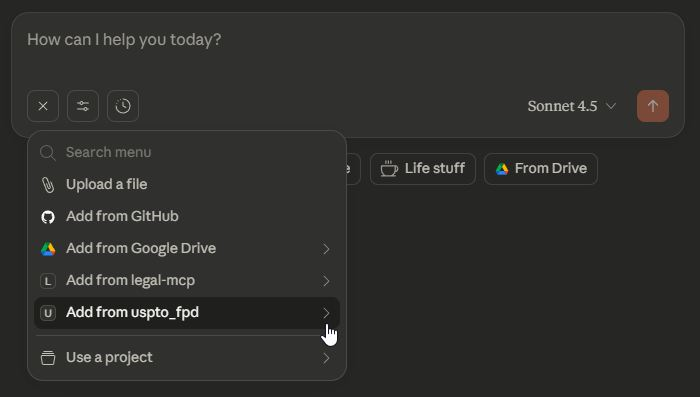
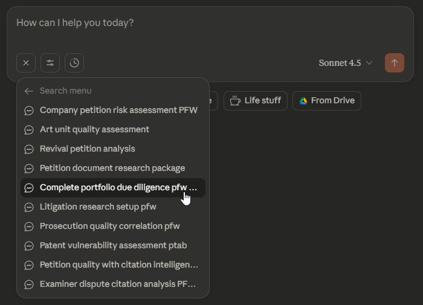
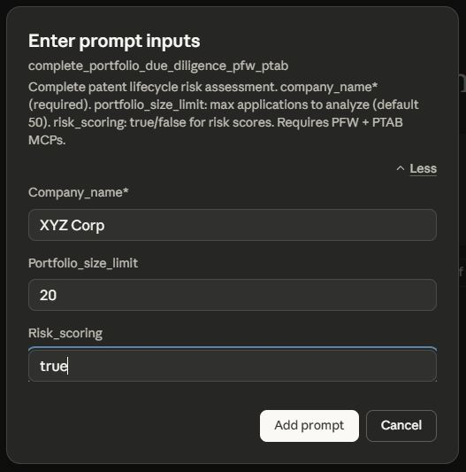
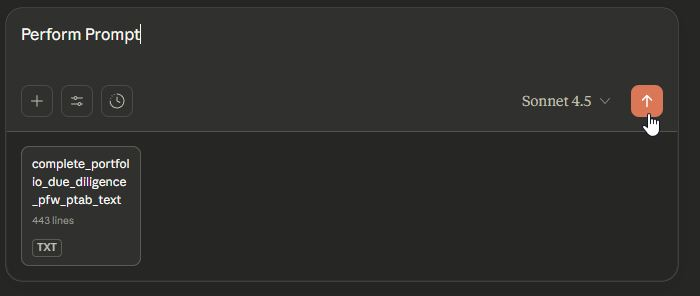

# USPTO Final Petition Decisions MCP - Prompt Templates

This document details the sophisticated prompt templates included with the USPTO Final Petition Decisions MCP Server for complex petition analysis workflows.

## ⚡️ Prompt Templates (Attorney-Friendly Workflows)

**NEW FEATURE**: The FPD MCP now includes 10 prompt templates that appear in Claude Desktop UI. These templates automate complex multi-step workflows and eliminate the need to memorize tool syntax.

### 🎯 **How to Use Prompt Templates**

1. **In Claude Desktop**: Press the `+` button

   

2. **Select "Add from uspto_fpd"** from the dropdown menu

   

3. **Select the desired Prompt** from the dropdown menu. Note some prompts require the installation of the developer's other USPTO or Pinecone MCP servers - those requirements are denoted in the title of the Prompt, e.g. "Complete Portfolio Due Diligence PFW PTAB" you would need the USPTO PFW MCP and USPTO PTAB MCP in addition to the USPTO FPD MCP

   

4. **Fill in the parameters** (petition IDs, application numbers, company names, etc.) Read the guidance for which fields are required and format of some fields

   

5. **Execute** - For best results type "Perform Prompt" and start the chat.  Claude will run the complete workflow

   

## Overview

The MCP server includes AI-optimized prompt templates designed for patent attorneys and IP professionals. These templates provide structured workflows for common legal and research tasks, featuring flexible input processing, cross-MCP integration, and context-efficient guidance focused on petition analysis and red flag identification.

## 🎯 Legal & Patent Analysis Templates

### `/company_petition_risk_assessment_PFW` - Company Due Diligence Analysis
**Purpose**: Comprehensive due diligence analysis for petition red flags and prosecution quality assessment
**Key Features**:
- **Entity lookup**: Uses PFW MCP to find company applications and patents
- **Red flag detection**: Identifies revival petitions, examiner disputes, denied petitions
- **Cross-MCP correlation**: Links petition patterns to prosecution history
- **Risk scoring**: Quantifies prosecution quality issues and abandonment patterns

**Use Cases**:
- M&A due diligence and transaction review
- Portfolio quality assessment for licensing
- Investment decision support with prosecution risk analysis
- Competitive intelligence on petition filing patterns

**Integration**: Requires Patent File Wrapper (PFW) MCP for entity lookup and prosecution context

---

### `/patent_vulnerability_assessment_ptab` - PTAB Risk Prediction
**Purpose**: Correlate petition red flags with PTAB challenge outcomes for vulnerability prediction
**Key Features**:
- **Vulnerability scoring**: Predictive modeling based on petition history
- **PTAB correlation**: Links petition red flags to post-grant challenge success rates
- **Defensive strategy**: Recommendations for strengthening vulnerable patents
- **Settlement guidance**: Risk assessment for litigation settlement decisions

**Use Cases**:
- PTAB defense strategy development
- Portfolio risk management and pruning decisions
- Settlement negotiation support
- Patent acquisition risk assessment

**Integration**: Requires USPTO PTAB MCP for post-grant challenge correlation analysis

---

### `/litigation_research_setup_pfw` - Litigation Preparation Workflow
**Purpose**: Prepare comprehensive litigation research with prosecution history and petition analysis
**Key Features**:
- **Integrated discovery**: Combines prosecution documents with petition decisions
- **Timeline reconstruction**: Maps petition events to prosecution milestones
- **Evidence compilation**: Organizes materials for expert witness preparation
- **Procedural analysis**: Identifies prosecution quality issues for invalidity arguments

**Use Cases**:
- Patent litigation preparation and discovery
- Invalidity defense development
- Expert witness preparation materials
- Prior art and prosecution history analysis

**Integration**: Requires Patent File Wrapper (PFW) MCP for prosecution context and document access

## 📊 Prosecution & Research Templates

### `/art_unit_quality_assessment` - Examiner Pattern Analysis
**Purpose**: Evaluate art unit prosecution quality via petition patterns and examiner dispute rates
**Key Features**:
- **Statistical analysis**: Grant rates, petition frequencies, examiner dispute patterns
- **Benchmarking**: Comparative analysis across art units and time periods
- **Quality metrics**: Quantitative assessment of prosecution quality issues
- **Strategic recommendations**: Data-driven guidance for prosecution strategy

**Use Cases**:
- Art unit selection for continuation applications
- Examiner training and quality improvement initiatives
- Prosecution strategy optimization
- Patent office process improvement analysis

**Integration**: Standalone FPD analysis, enhanced with PFW MCP for prosecution correlation

---

### `/prosecution_quality_correlation_pfw` - Cross-Database Quality Analysis
**Purpose**: Correlate examiner patterns with petition frequency for comprehensive quality assessment
**Key Features**:
- **Statistical correlation**: Links prosecution patterns to petition filing rates
- **Examiner profiling**: Individual examiner quality metrics and trends
- **Predictive modeling**: Forecasts petition likelihood based on prosecution patterns
- **Training recommendations**: Data-driven examiner improvement suggestions

**Use Cases**:
- Examiner training program development
- Quality control and process improvement
- Prosecution strategy optimization for specific examiners
- Patent office management and oversight

**Integration**: Requires Patent File Wrapper (PFW) MCP for prosecution pattern analysis

---

### `/revival_petition_analysis` - Abandonment Pattern Research
**Purpose**: Find abandonment patterns and revival success rates for risk assessment
**Key Features**:
- **Abandonment analysis**: Systematic review of revival petition patterns
- **Success factor identification**: Determines factors correlating with successful revivals
- **Risk assessment**: Quantifies abandonment risk for portfolio management
- **Process improvement**: Identifies docketing and deadline management issues

**Use Cases**:
- Abandonment risk assessment and prevention
- Docketing process improvement initiatives
- Portfolio management and deadline oversight
- Law firm quality control and training

**Integration**: Standalone FPD analysis, enhanced with PFW MCP for prosecution context

## 📁 Document Management Templates

### `/petition_document_research_package` - Comprehensive Document Retrieval
**Purpose**: Collect comprehensive petition documents for specific case analysis
**Key Features**:
- **Organized retrieval**: Systematic collection of all petition-related documents
- **Priority-based selection**: Focuses on most relevant documents for analysis goals
- **Cost optimization**: Strategic document extraction to minimize OCR costs
- **Legal analysis preparation**: Organizes materials for attorney review

**Use Cases**:
- Litigation preparation and case analysis
- Director's reasoning research for similar cases
- Patent prosecution strategy development
- Academic and policy research on USPTO decisions

**Integration**: Standalone FPD document management, enhanced with secure browser downloads

---

### `/complete_portfolio_due_diligence_pfw_ptab` - Full Lifecycle Analysis
**Purpose**: Complete patent lifecycle risk assessment from filing through post-grant challenges
**Key Features**:
- **Triple-MCP integration**: Orchestrates PFW, FPD, and PTAB data for complete analysis
- **Lifecycle tracking**: Maps entire patent journey from filing to post-grant
- **Predictive risk modeling**: Comprehensive vulnerability assessment
- **Strategic recommendations**: Actionable insights for portfolio optimization

**Use Cases**:
- M&A transaction due diligence
- Portfolio optimization and pruning decisions
- Competitive intelligence and market analysis
- Investment decision support for patent assets

**Integration**: Requires Patent File Wrapper (PFW) MCP and USPTO PTAB MCP for complete lifecycle view

## 🔧 Input Processing Features

All prompt templates include **Enhanced Input Processing** capabilities:

### Flexible Identifier Support
- **Petition IDs**: UUID identifiers from FPD searches
- **Application Numbers**: "17896175", "17/896,175", "US17/896,175"
- **Patent Numbers**: "9049188", "US9049188B2", "9,049,188"
- **Company Names**: "TechCorp Inc.", partial company names

### Smart Validation
- **Input type detection**: Automatically determines identifier format
- **Format normalization**: Standardizes various input formats
- **Validation guidance**: Provides helpful error messages and suggestions
- **Cross-MCP linking**: Identifies opportunities for enhanced analysis

### Context Optimization
- **Progressive disclosure**: Minimal → balanced → detailed information retrieval
- **Token efficiency**: 80-99% context reduction through targeted field selection
- **Cost transparency**: Clear indication of OCR costs and optimization strategies
- **Strategic guidance**: Built-in recommendations for efficient workflows

## 📈 Enhanced Citations Integration Templates

### `/petition_quality_with_citation_intelligence_PFW_FPD_CITATIONS` - Three-MCP Analysis
**Purpose**: Art unit petition quality assessment enhanced with AI-extracted citation intelligence
**Key Features**:
- **Citation correlation**: Links petition patterns to examiner citation quality
- **AI-powered analysis**: Uses machine learning for citation pattern recognition
- **Quality metrics**: Comprehensive assessment combining petition and citation data
- **Date-aware analysis**: Respects Citations API coverage (Oct 2017+ office actions)

**Use Cases**:
- Comprehensive art unit quality assessment
- Examiner performance evaluation with citation intelligence
- Prosecution strategy optimization based on citation patterns
- Patent office training and improvement initiatives

**Integration**: Requires Patent File Wrapper (PFW) MCP and Enhanced Citations MCP

---

### `/examiner_dispute_citation_analysis_PFW_FPD_CITATIONS` - Root Cause Analysis
**Purpose**: Analyze citation patterns in examiner dispute petitions to identify prosecution quality issues
**Key Features**:
- **Dispute correlation**: Links examiner disputes to citation quality issues
- **Root cause identification**: Determines underlying factors in petition disputes
- **Training recommendations**: Data-driven suggestions for examiner improvement
- **Comparative analysis**: Disputes vs. non-disputed application comparison

**Use Cases**:
- Examiner performance assessment and training
- Root cause analysis for dispute reduction
- Quality control and process improvement
- Patent office management oversight

**Integration**: Requires Patent File Wrapper (PFW) MCP and Enhanced Citations MCP

## 🎯 Usage Recommendations

### For Patent Attorneys
- **Start with `/company_petition_risk_assessment_PFW`** for client due diligence and risk assessment
- **Use `/patent_vulnerability_assessment_ptab`** for PTAB defense strategy development
- **Apply `/litigation_research_setup_pfw`** for comprehensive litigation preparation
- **Leverage `/petition_document_research_package`** for organized case material compilation

### For IP Professionals
- **Begin with `/art_unit_quality_assessment`** for prosecution strategy optimization
- **Employ `/complete_portfolio_due_diligence_pfw_ptab`** for M&A and investment decisions
- **Utilize `/prosecution_quality_correlation_pfw`** for examiner and process assessment
- **Use `/revival_petition_analysis`** for portfolio risk management

### For Research & Development
- **Apply `/art_unit_quality_assessment`** for prosecution planning and art unit selection
- **Use citation intelligence templates** for comprehensive quality assessment
- **Leverage cross-MCP templates** for competitive intelligence
- **Employ context reduction strategies** for budget-conscious research

### Template Selection Guide

**Single-MCP Tasks**: Use standalone templates (art unit quality, revival analysis, document packages) for FPD-specific analysis

**Cross-MCP Analysis**: Use integration templates (litigation setup, portfolio due diligence, quality correlation) for comprehensive lifecycle view

**Citation Intelligence**: Use enhanced citation templates for applications filed 2015+ with office actions mailed Oct 2017+

**Emergency Response**: Use litigation and vulnerability templates for urgent defensive needs

## 📊 Cross-MCP Integration Matrix

| Template | PFW MCP | Citations MCP | PTAB MCP | Integration Level |
|----------|---------|---------------|----------|-------------------|
| **Company Risk Assessment** | **Required** | Optional | Recommended | **Entity lookup + analysis** |
| Art Unit Quality | Recommended | Optional | Optional | Quality correlation |
| Revival Analysis | Recommended | Optional | Optional | Risk correlation |
| Document Package | Optional | - | Optional | Context enhancement |
| **Portfolio Due Diligence** | **Required** | Optional | **Required** | **Complete lifecycle** |
| **Litigation Setup** | **Required** | - | Optional | **Prosecution context** |
| **Quality Correlation** | **Required** | Optional | Optional | **Statistical analysis** |
| **Vulnerability Assessment** | Optional | - | **Required** | **Predictive modeling** |
| **Petition Quality + Citations** | **Required** | **Required** | - | **Citation intelligence** |
| **Examiner Dispute + Citations** | **Required** | **Required** | - | **Root cause analysis** |

## 🔧 Performance & Integration

### Context Reduction Achievements
- **Traditional approaches**: 100KB+ responses with full API dumps
- **Optimized prompts**: 2-10KB focused responses (80-99% reduction)
- **Smart field selection**: Only retrieve data needed for specific analysis
- **Progressive workflows**: Build complexity only when necessary

### Cross-MCP Integration Patterns
- **FPD Foundation**: All templates start with petition research
- **PFW Enhancement**: Prosecution history and document access
- **PTAB Enrichment**: Post-grant challenge analysis and vulnerability assessment
- **Citations Intelligence**: AI-powered examiner behavior and citation pattern analysis

### Workflow Orchestration
1. **Discovery Phase**: Minimal petition searches for candidate identification
2. **Selection Phase**: Human/AI selection of relevant petitions and patterns
3. **Analysis Phase**: Targeted data retrieval and structured analysis
4. **Integration Phase**: Cross-MCP data correlation and synthesis
5. **Documentation Phase**: Organized output with actionable recommendations

---

*For detailed usage examples and integration workflows, see [USAGE_EXAMPLES.md](USAGE_EXAMPLES.md).*

*For setup and installation guidance, see [README.md](README.md) and [INSTALL.md](INSTALL.md).*